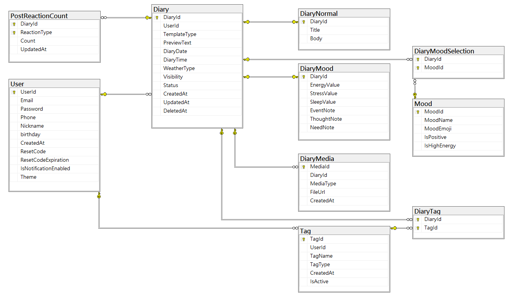

# Moody_DiarySystem
ASP.NET Core MVC 日記系統，負責日記管理模組、資料庫設計與 CRUD 功能實作。

## 專題簡介
Moody 是一套情緒日記系統，提供一般日記與心情日記兩種模板，支援標籤分類、圖片上傳、畫布繪圖與日記分享。

## 我負責的功能
- 日記新增、編輯、查詢
- 一般日記與心情日記模板
- 標籤分類
- 圖片與畫布媒體資料規劃
- 日記資料庫設計與關聯規劃

## 使用技術
- C#
- ASP.NET Core MVC
- SQL Server
- HTML / CSS / JavaScript

## 資料庫設計
依照功能需求規劃8張資料表，包含日記主表、一般日記表、心情日記表、情緒表、標籤表、日記標籤關聯表、日記情緒關聯表與媒體表，建立一對一、一對多與多對多關聯。

### 資料庫檔案

- [建立資料表 SQL](Database/create_tables.sql)
- [假資料 SQL](Database/insert_sample.sql)

### 資料表規劃

|       資料表       |           說明           |
------------------------------------------------
| Diary              | 日記主表，存放共用欄位 |
| DiaryNormal        | 一般日記內容 |
| DiaryMood          | 心情日記內容 |
| Mood               | 情緒選項 |
| Tag                | 標籤資料 |
| DiaryTag           | 日記與標籤的多對多關聯 |
| DiaryMoodSelection | 心情日記與情緒的多對多關聯 |
| DiaryMedia         | 日記圖片與畫布媒體資料 |

## 遇到的問題與解法
一般日記與心情日記欄位不同，若全部放在同一張資料表，會造成欄位混雜與大量空值。因此將共用欄位放在 Diary 主表，再拆出 DiaryNormal 與 DiaryMood，並透過關聯表處理標籤與情緒多選資料，讓資料結構更清楚，也方便後續 CRUD 查詢與維護。
